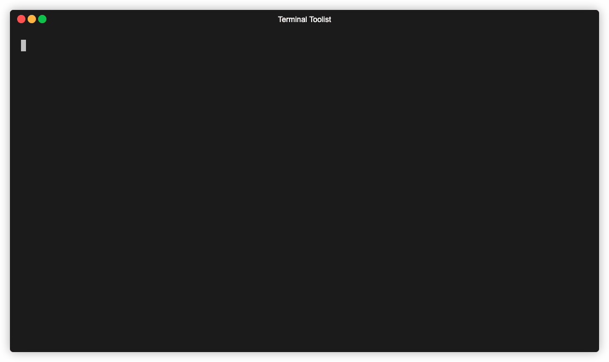
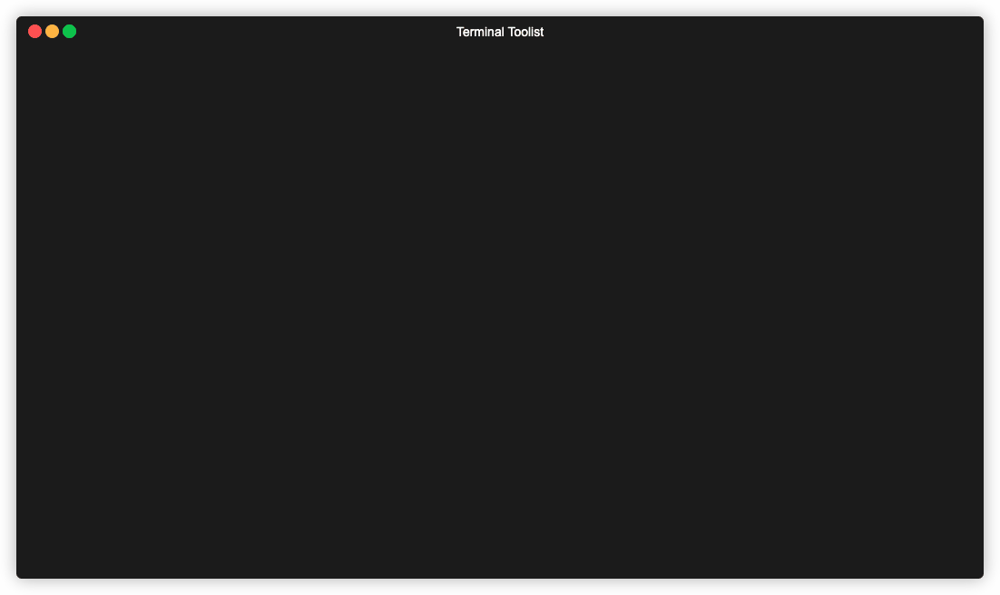
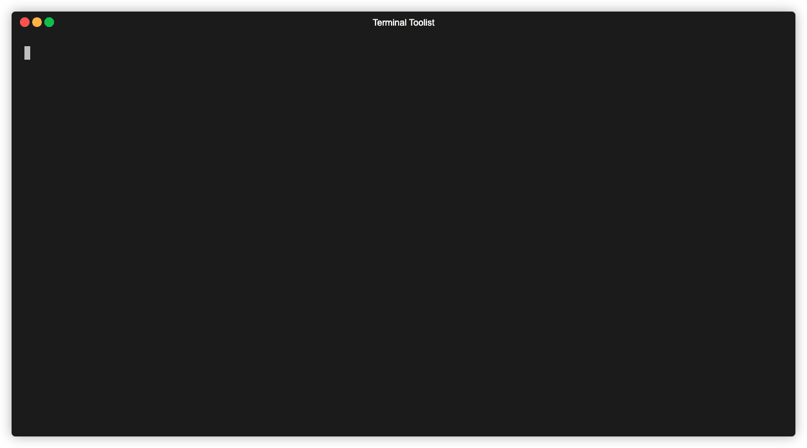

+++
date = '2023-12-14T16:00:00-06:00'
draft = false
title = 'fzf'
show_reading_time = true
tags = ['review']
+++

# Overview

Without any arguments or data piped from standard input
[fzf](https://github.com/junegunn/fzf) acts as a sort of interactive
[find](https://man7.org/linux/man-pages/man1/find.1.html) by listing every file
in the current and all sub-directories.



As you can see, the options are filtered live as you type. Spaces start a new
search term which can match any part of the file regardless of the order you
type them in. You can use `!` to negate a search term and filter out items which
match that term.

# Finding files

As you saw from above, the default behavior of fzf is already very powerful, but
it can do much more. Some of the power comes from its ability to be composed
with other shell commands.

Say you wanted to view the first handful of lines from a file. The kubernetes
file specification states the `kind` field must state what kind of resource the
configuration represents. Using
[head](https://man7.org/linux/man-pages/man1/head.1.html) and a
[sub-shell](https://tldp.org/LDP/abs/html/subshells.html) running fzf, we can
combine the action of finding the file with the effect of getting the `head` of
it.

_NOTE: in these examples I am using [fish](https://fishshell.com) shell, so
sub-shells are written_ _with `(command)`, rather than the posix standard method
of `$(command)`._



You can also see in this example that you can move the selection up and down.
Whichever item is selected when entered is pressed is printed to standard out.

Another useful combination of commands is opening the selected file in your
editor of choice.


# Fuzzy finding standard input

By itself fzf runs [find](/posts/find) internally and presents the results to
filter. If provided with input through standard input, fzf then becomes a
general purpose fuzzy filter.


As you can see, the content of the `git branch` command was used as input which
we can filter. Providing some additional flags to the git command will give us
more context to filter on:


This can be supercharged by taking the branch selection and running
`git checkout` on the branch[^1]:

```bash
function fbr {
  local branches branch
  branches=$(git --no-pager branch -vv)
  branch=$(echo $branches | fzf)
  git checkout "$(echo $branch | awk '{print $1}' | sed 's/.* //')"
}
```

This function grabs the list of git branches (with the additional context
provided by `-vv`), selects one with fzf, and then plucks the branch name out of
the selection (and then removing the `*` using [sed](/posts/sed)). With the
branch name isolated, we run `git checkout`.

Using this, you have an interactive branch selection tool which gives you move
information about the branches context.

# Making a Better `cd`

If you know your way around [find](/posts/find), you can supercharge other
commands as well. Let's take a look at how we can improve the ergonomics of
[cd](https://man7.org/linux/man-pages/man1/cd.1p.html).

When at the root of a project with many nested folders, it can be a bit of a
pain to cd into a folder deep in the project. You can either do it iteratively,
running cd, inspecting the contents of the new directory, find the next folder,
and run cd again. A slightly faster approach uses tab
[completion](https://www.gnu.org/software/gnuastro/manual/html_node/Bash-TAB-completion-tutorial.html)
in order to drill into the target destination and only running cd once.

We can do better. Using find we can list all of the directories, recursively:

```bash
find . -type d ! \( -path '*/.git/*' -or -path '*/node_modules/*' \)
```

```
.
./frontend
./frontend/dist
./frontend/node_modules
./backend
./files
./.git
./kubernetes
./.idea
```

Using `cd` and a sub-shell running find piped to fzf gives you an interactive cd
command that can directly jump you to an arbitrarily deep folder by typing the
minimum necessary key to find it:[^2]


# Preview

Another super power of fzf is the ability to preview your selection. With the
default behavior of listing all files, you can preview those files with any
command you want. The intuitive option would be
[cat](https://man7.org/linux/man-pages/man1/cat.1.html), but if you have it
available on your system, [bat](https://github.com/sharkdp/bat) is even cooler:


# Multiple selection

Fzf supports selecting multiple inputs and prints all selected items to standard
out.


You can take this in a lot of directions.

For instance, you can install Homebrew packages via an interactive list of all
available brew packages:

```bash
# (F)zf (B)rew (I)nstall
# Takes input as a filter for brew search,
# and installs all packages selected in a
# loop.
function fbi {
local packages=$(brew search "$@" | fzf -m)
if [[ $packages ]]; then
    for $package in $(echo $packages); do
    brew install $package
    done
fi
}
```



# Shell integration

Fzf also comes with nice shell
[integration](https://github.com/junegunn/fzf#fuzzy-completion-for-bash-and-zsh).
When enabled, it hooks into zsh and bash completion engines (think of hitting
tab and the list of files shows up). This means you get fzf wired into many
common commands for free without the overhead of thinking about how to invoke it
correctly.

_NOTE_: I'm running the following example in zsh because I couldn't get the
shell integration to work in my normal shell (in case you were wondering why the
prompt looks different).


# But wait, there's more

And how much more there is! You can set custom headers, prompts, keybindings to
run arbitrary code when pressing that key, switching which command feeds input
to fzf on the fly. I don't have nearly enough time to go into it, but to see a
taste of what it's capable take a look at this
[video](https://www.youtube.com/watch?v=WFy6JXBRSJc).

I would also recommend crawling through the fzf
[wiki](https://github.com/junegunn/fzf/wiki/Examples) which has numerous
examples of supercharging many applications.

# Conclusion

Fzf is hard to not love. It feels like the sort of tool whose power is only
limited by my imagination. Once you start recognizing cases where you need to
pick out a single item from a list (killing a process from `ps`, updating an OS
service using `systemctl`, etc.) fzf steps up and makes it interactive.

Give it a shot, let your imagination go wild. Filter on, friends.

# Footnotes

If you wanted, you could remove the path filtering from the find command and
just filter them out using fzf (`!node !git`), but this method reduces the noise
you have to look at when first running the command.

[^1]: This example is taken from the fzf
    [wiki](https://github.com/junegunn/fzf/wiki/Examples#git). There are a lot
    of examples here, both for git and many other tools. It's a treasure trove
    of ideas and cool goodies.

[^2]: In case you want to copy and paste, the command was:

    ```bash
    cd (find . -type d ! \( -path '*/.git/*' -or -path '*/.node_modules/*' \) | fzf)
    ```
