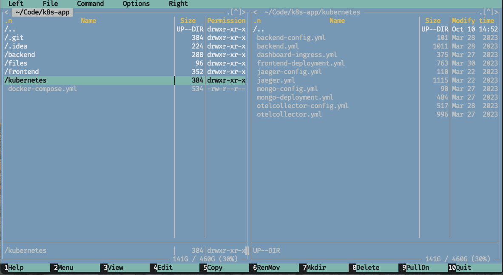
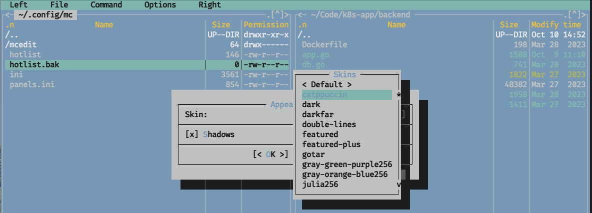
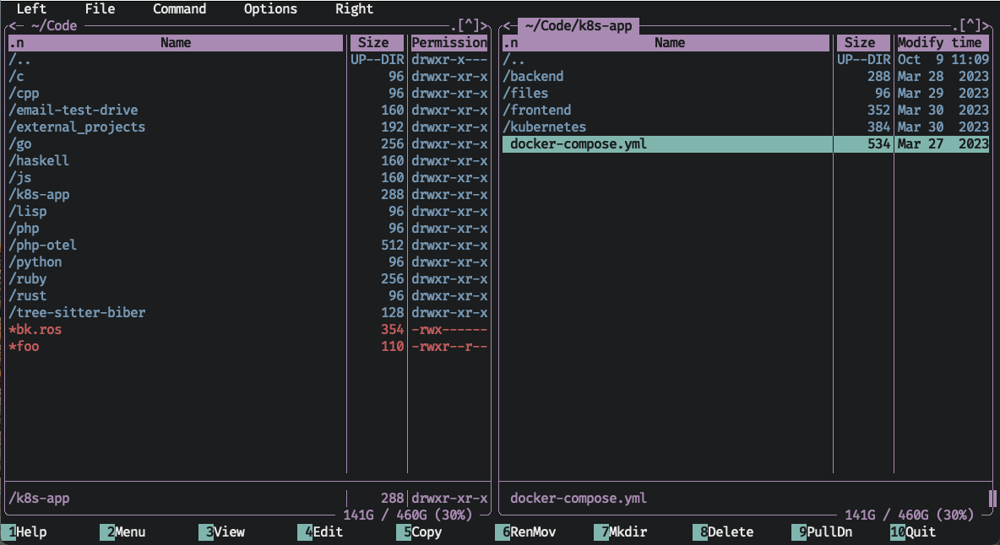
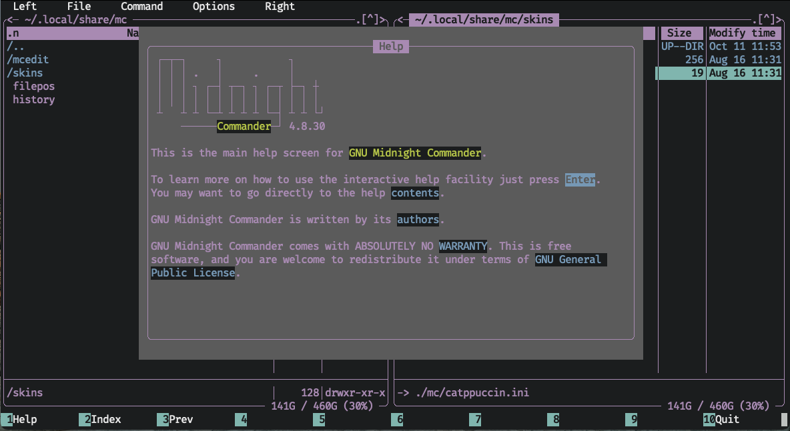
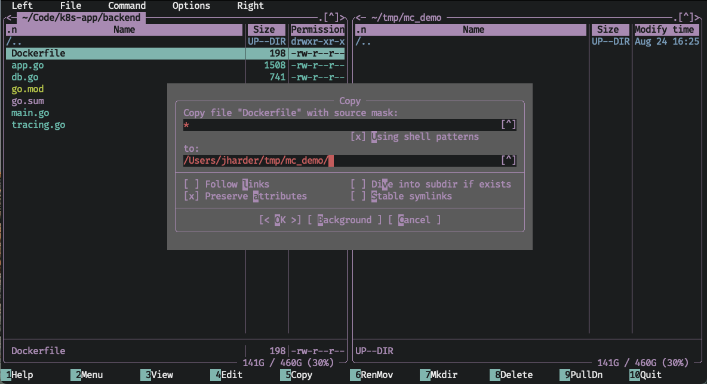

+++
date = '2023-10-13T16:00:00-06:00'
draft = false
title = 'Midnight Commander'
tags = ['file_manager', 'review']
+++

# mc

Let's start with a quick screenshot of mc in action.



Eww. How very...MS Dos (or maybe this is nostalgic for you. To each their own).
This is intentional; as it started life as a clone of the popular
[Norton Commander](https://en.wikipedia.org/wiki/Norton_Commander). It was first
released in 1994 (8 years after its predecessor) and replicated the dual window
text user interface almost exactly.

Fortunately for us, mc allows you to change its appearance through the options
menu. I've downloaded the [Catppuccin](https://github.com/catppuccin/mc) theme
and installed it.




Let\'s take another look:



Much better.

## Overview

This is midnight commander (or `mc` for short). If you read the previous post
about [ranger](/posts/ranger), you\'ll notice there are two windows not three.
Less obvious is the fact that these two windows are disconnected from each
other. Where ranger\'s columns represented the parent and child directories of
the current path, these windows are two separate file explorers. Each can be
moved about the file system independently of each other.

Why have two disconnected file viewers? For one extremely helpful reason. Any
file or directory action that requires a destination will default to the path of
the other window. Let\'s see an example. As usual, mc can be installed using
Homebrew:

```shell
brew install mc
```


In this example, you can see the left window is viewing
`~/Code/k8s-app/backend`, and the right window is viewing `~/tmp/mc_demo`. On
the bottom you\'ll see the numbers 1-10 and an action next to each. These are
the basic commands you\'ll likely use most when using mc. Each number indicates
which function key triggers the command (`f1` through `f10`).

# Interacting with mc

Midnight commander does not attempt to emulate vim bindings, but rather seeks to
replicate a graphical application with menu bar and all. You can even click on
almost any element on the screen and interact with it primarily with your mouse.
The most common commands of a file manager: Viewing, Editing, Copying, Moving,
Deleting, Mkdir.ing, are all one shortcut away using the function keys. Hints
are provided at the bottom, including access to a robust help manual:



## Basic Copy, Rename, Delete

As the bottom row suggests, you can copy the highlighted file with `f5`. It will
be copied to the other window (by default, you can edit the destination if you
want to copy to a different destination).



The same is true for `RenMov`, short for `Rename/Move`. Hitting `f6` will open
the `Move` prompt. The destination defaults to the other window and if you just
hit enter, it will be moved there.

To rename, open the `RenMov` dialog again. To simply rename the file, start
typing the new name and the `To:` field will be replaced with your new name.
Hitting enter will rename the file but keep it in the same directory. To move
and rename the file, open the `RenMov` prompt, but before you start to type the
new name, hit `<right>` first, this will cause whatever you type to be appended
to the `To:` prompt rather than overwrite it (you should see the color of the
populated field change color to indicate it changing from overwrite to append
mode). Hitting enter will move the file to the other window and rename it to
whatever you typed.

## Advanced Copy, Rename, Delete

Like ranger, you can select multiple files to execute any of the actions on. Hit
`+` to open up a prompt for selection. You can leave the value as is, `*` for
selecting all entries in the current window, or any regex you want to select
only the matching items. If you want to unselect all files or files matching
some regex, hit `-`.

To select individual files, just hit `Control-t`.

From here, any `Copy`, `RenMov`, or `Delete` command will apply to all selected
files.

## Interacting With the Windows

You can swap focus between windows with `Tab`. To synchronize the directory
viewed by the unfocused tab, hit `Option-i`. To enter the currently selected
directory in the other window, hit `Option-o`. To quickly jump to a file path
without having to navigate up or down the directory tree, simply hit `Option-c`
and a `cd` prompt you for the path to jump to. If you want to swap the positions
of the two windows with each other, hit `Control-u`.


## Viewing and Editing Files

There are a few different ways you can view files, depending on your needs. You
can use the `View` quick command (bound to `f3`). This will either open the
built in file viewer, a fairly bare bones pager, or you can use some external
file viewer (done by toggling the `Options->Configuration->'Use internal view'`
option).

The same is true for editing files (bound to `f4`. Mc comes with a file editor,
equally bare bones, but that can be changed by toggling the
`Options->Configuration->'Use internal edit'` option.

For a quicker way to peruse files, you can turn on \"Quick View\" mode (bound to
`Control-x q`). In this mode, any regular file that is selected in the active
window will have its contents shown in the inactive window. When you navigate
around, the preview window will update accordingly. It even comes with some
basic search and go to functionality.


## Hotlist

The \"hotlist\" is mc\'s name for what would commonly be called bookmarks today.
Using the hotlist (bound to `Control-\`), you can save a list of directories
that you often visit and quickly navigate back to them. You can add new
directories by first going through this menu, or from the main screen by hitting
`Control-x h` to quick add the current directory to the hotlist.


If you have a lot of directories in the hotlist, you can make \"groups\" (more
like folders) to store logically similar directories together. Just use the
`New group` option and you\'re good to go. You can save new directories into
them, or move existing entries into or out of them.

# Customization

Midnight commander is very, very customizable. All its configuration is stored
in `~/.config/mc/ini`[^1]. You could edit this file by hand, but for most
settings, you can go through the `Options` menu to visually edit them[^2].

You can also customize the `User menu`. This is a quick list of actions to
perform on the selected file(s) you can access any time from the `Command` menu
or with `f2`.


In today\'s day and age, I find a couple of these actions helpful, like
`tar.gz`-ing the current directory or viewing a man page, but others like _Strip
headers from current newsarticle_.quaint. However even this menu is
customizable! You can add, remove, or edit any command in this menu that you
like. If there\'s commands that you often run only in the context of a
particular directory, you can create a local user menu file. How this file
actually works and what all the weird symbols mean is an exercise left to the
reader.

# Conclusion

The dual window setup might feel a little awkward at first if you\'re not used
to it, but after getting comfortable with it you\'ll groan every time you have
to write out a whole copy command by hand, or open up another finder window and
click around until you\'ve found the right directory to copy to.

The heavy reliance on function keys is a bit of a bummer for me as they are far
away from the home row and require some hand contortions on the mac keyboard to
hit the `fn` key. This can be mitigated in part if you use a keyboard with
[configurable firmware](https://qmk.fm/) by placing the function keys in a more
ergonomic location in a layer, but being forced to do this because of my file
manager is a fairly large ask. You can set up some alternate key bindings for
some of the shortcuts, but not the primary ones you see at the bottom of the
screen. I know I am probably in the minority in my unrelenting pursuit of the
perfect ergonomic workflow, so you mileage may vary.

Midnight commander may be from a different era, and so some of its design
patterns may be old fashioned, and the terminology my be unfamiliar, but it is
an extremely powerful workhorse of a file manager. Older software might not be
new and shiny, but it has stood the test of time. For any question you may have
on how to do something, there is likely an answer found online. Is there a
feature you liked from some other file manager? Someone else has probably missed
that feature and written a patch for mc enabling it. New apps may come and go,
but mc remains. If the keybindings don\'t deter you, there could be a very long
and happy future for you and midnight commander. If you\'re not a fan, stay
tuned for next week\'s article.

# Alternatives

If you\'re on Linux, [Double Commander](https://doublecmd.sourceforge.io/) is a
good GUI based dual window file manager. Unfortunately, it has lost support for
macOS. [MaxCommander](https://www.mplsoftware.com/products/maxcommander) looks
like a good mac native option (**note**: I have not tried either of these
applications, but have heard good things). It uses `Command-num` based shortcuts
instead of function keys which sounds far more ergonomic to me. It is currently
\$7.99 as of the time of writing this article and closed source, which could be
a deal breaker for you. If you happen to give it a shot, let me know how you
like it.

# Additional Resources

- [key bindings](https://midnight-commander.org/wiki/doc/common/actions)
- [video overview](https://www.youtube.com/watch?v=fJOkuaihAek)

# Footnotes

[^1]: There are other files in the `~/.config/mc` directory that are updated
    when changing certain settings, but `ini` is the primary one.

[^2]: Just be sure to save your changes (the last option in the `Options menu`).
