+++
date = '2023-12-01T16:00:00-06:00'
draft = false
title = 'nb'
tags = ['notes', 'review']
+++

# Overview

[nb](https://xwmx.github.io/nb) is a swiss army knife of a note taking tool
operated entirely[^1] in within the command line.

The `nb` command is your launch pad for everything note related. Without
arguments `nb` shows you an overview of your existing notes or a quick cheat
sheet of common actions if there are no notes.


Once you've created a few notes, `nb` (without arguments) instead displays all
the notes in your current notebook (more on [notebooks](#Notebooks) later)


`nb` allows for quick jotting down of notes, tasks, bookmarks. In addition, it
provides the means of organizing your notes so you don't end up with a jumbled
mess of random thoughts.

What follows will be a whirlwind tour of the major features mention with some
practical examples.

# Notes

The note. The foundational concept of any note taking system. A good system
allows for quickly jotting down thoughts, organizing those thoughts into some
system that aids in note retrieval, and (in my opinion) is flexible enough to be
adapted to the user's individual preferences in format and structure.

## Creating

`nb` hits these marks fairly well. For creating notes, `nb` is spectacular.
`nb add` (or `nb a`) creates a new note. If ran interactively, it will open up
your editor of choice (configurable through `nb set editor`) with a blank note,
ready to capture whatever thought you have. Ran non-interactively, `nb` will
simply create a new note.

`nb add "here is my great idea"` will create a new note, and add the content you
provide (either through positional arguments, or through standard input:
`echo hello world | nb add`) without ever opening up an editor. This allows for
extremely quick note entry, meaning it hardly intrudes on whatever you were
doing when you had your thought.

Starting with an empty notebook, here's the results of the various forms of note
entry:

```bash
nb add
```

```
Added: [1] 20231129110012.org
```

Viewing the current notes with `nb` now gives us this:

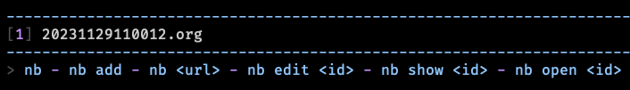

Creating a note with content from provided arguments looks like this:

```bash
nb add "A new note"
```

```
Added: [2] 20231129110836.org
```

And the result:


And just to show you that it's possible, I'll create a note through a pipeline:

```bash
echo hello from a pipeline | nb add
```

```
Added: [3] 20231129111327.org
```


## Titles

The notes created so far do not have a title, so `nb` has just been naming the
note files with a timestamp and displaying the first line of content to help
provide context about the note.

`nb` provides support for note titles, using the `--title` flag when creating
the note.

```bash
nb add "This is the content of the note" --title "A Note With a Title"
```

```
Added: [4] a_note_with_a_title.org "A Note With a Title"
```

You will notice the note now has a descriptive file name, and when viewed in the
notes list, the title is displayed instead of the file name.

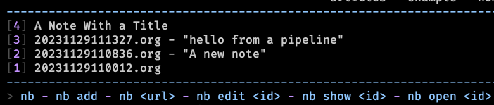

## Tags

[Tags](https://xwmx.github.io/nb/#-tagging) can be added to notes on creation
time with the `--tags` flag.


This will create a file with two tags in it: `#notes` and `#example`.

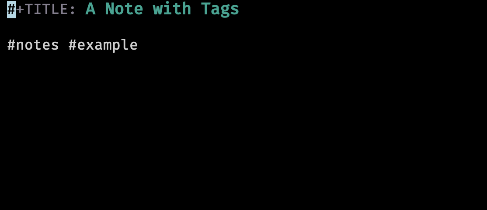

You can view all the tags you\'ve added to notes in your notebook by just
passing the `--tags` flag to `nb`.

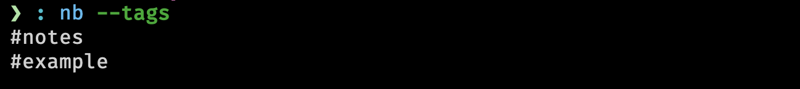

Tags are a great way of organizing your thoughts, as they provide a way to
search for notes using boolean logic (i.e. find my notes with `this` tag but
**not** `that` tag). You'll see more of them in the seciton on
[searching](#Search).

## Viewing

Creating notes is great, but viewing notes is arguable the only other mission
critical feature of a note taking system.

`nb` has multiple ways of viewing notes, depending on your use case.

To simply see the contents of a note, you can use `peek` or `show`, and the name
or id of the note.


After hitting enter, a command line content viewer opens up.


This opens up a read only view of the note (using
[less](https://man7.org/linux/man-pages/man1/less.1.html) by default).

To have the note just printed to stdout, you can add the `--print` flag.


If you have the [bat](https://github.com/sharkdp/bat) command, it will be used
instead of [cat](https://man7.org/linux/man-pages/man1/cat.1.html) to print the
contents of your note. This can be more easily seen when viewing a note with a
title:


`nb` does this sort of progressive enhancement in many ways. It will use the
basic posix tools available on every system by default, but will enhance its
functionality when a more modern alternative is available.[^2]

Lastly for purely viewing purposes, there exists the `--excerpt` flag on the
`list/ls` command. By default when no arguments are given to `nb`, it implicitly
run the `list` command. You can give `list` any
[selector](https://xwmx.github.io/nb/#-selectors) and it will only show items
which match that selector. When the `--excerpt|-e` flag is given, it will show
the first few lines of the item.

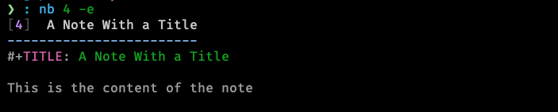

`nb` supports two commands for opening up the note in order to be interacted
with. `edit` does what you should expect, opening up the note in your editor.
`open` is almost identical, except when opening a bookmark, the bookmarked url
will be opened in your web browser (more on that in [bookmarks](#Bookmarks)).


This will open up the file in the configured editor (in my case, emacsclient).
Once you're done editing, simply save and close the file.

## Browse

Lastly, `nb` supports a terminal note browser (and also a local browser server
to view and edit your notes in a web browser). It is started with `nb browse` or
`nb b` for short.

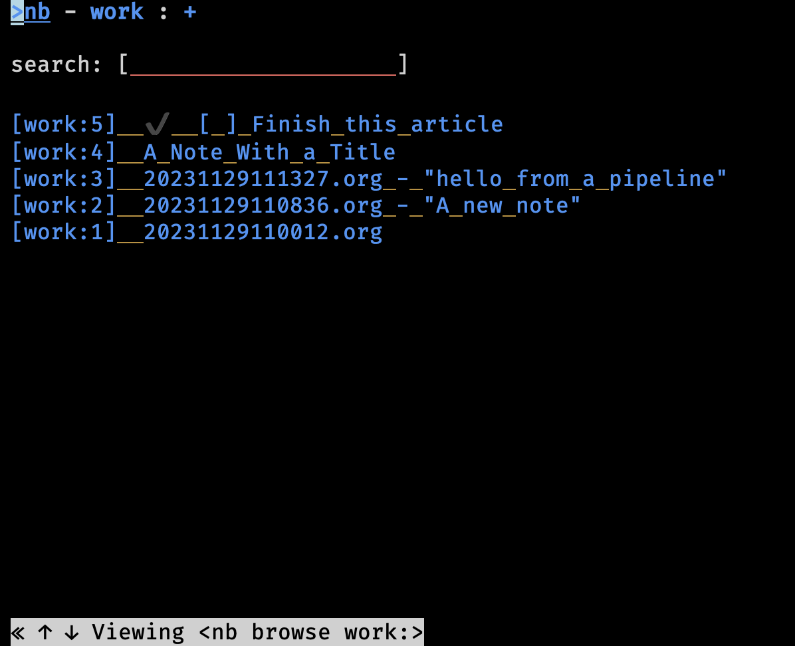

You can [search](#Search) from here as well as select notes to view and even
edit. If `browse` is ran with the `--gui` (or `-g` for short) flag, it starts a
local webserver so you can view your notes in a web browser.

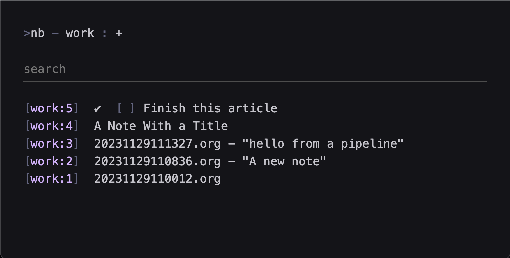

I won't go into much further detail on the browser, but if this interests you,
you can check it out yourself [here](https://xwmx.github.io/nb/#-browsing).

# Todos

`nb` excels in storing and retrieving notes, but it can handle todo items as
well. For this, `nb` differentiates `todos` from `tasks`. A `todo` is a overall
body of work to be done. In `nb`, a todo is stored in its own file and is
visible from the `list` command.

To create a todo, you can use the `todos` sub command with the `add` argument.

```bash
nb todos add 'Finish this article'
```

```
Added: [5] ✔️  20231129140921.todo.md "[ ] Finish this article"
```


Calling `nb todos` without any arguments will list only the items of type todo.


A `task` is a single component of a `todo`. A `todo` can have many `tasks`. You
can add tasks to a todo at creation time with the `--task` flag if you know what
they will be up front.

```bash
nb todos add 'Learn about todos and tasks' --task 'learn about todos' --task 'learn about tasks' --task 'learn how to complete todos'
```

```
Added: [6] ✔️  20231129141554.todo.md "[ ] Learn about todos and tasks"
```

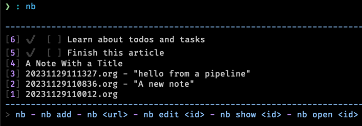

As you can see, only the top level `todo` is display in the `list` view. Using
the `tasks` command will show us each todo and its associated tasks if it has
any.

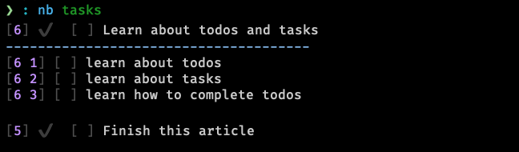

Todos can be checked off using `nb todos do` or `nb do` for an even shorter
method.


Tasks can be checked off is the same way using the selector as it\'s displayed
in the `tasks` view.


Unchecking a task is done with `undo`.

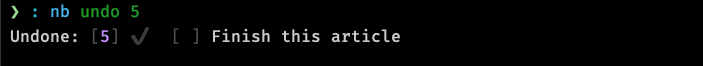

Internally, todos (and tasks) are just markdown files `nb` manages for you. You
can look at them directly and even edit them by hand if you want. This can be
helpful if you want to put more context into the todo.

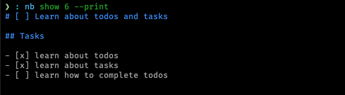

And when running `nb edit 6`:[^3]

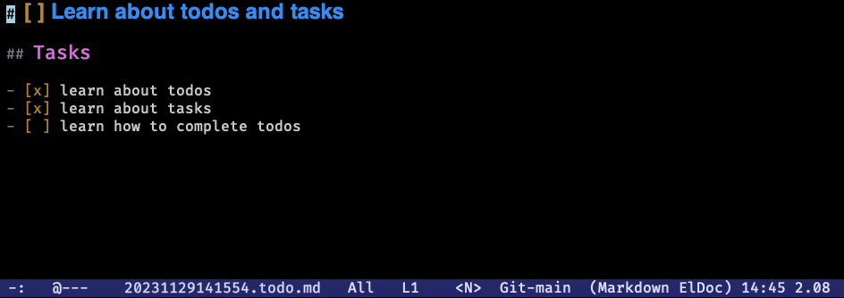

# Bookmarks

Bookmarks are one more type of note-adjacent item you can store in `nb`. They
are created by providing `nb` with a url. `nb` will store the url and scrape the
website for its title and convert the content into markdow to store along with
the link.

This is a great way both to keep track of a url for later, but also for
distraction free, offline viewing of the site at some future date.

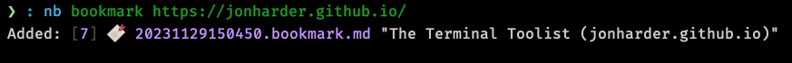 Technically the `bookmark` part of the above command is
optional. When you give an argument that looks like a url to `nb`, it is aware
and creates a bookmark for you. e.g. `nb https://google.com` would bookmark
google.


As you can see, `nb` parsed the title of the website, and stored the url
provided. If you tell nb to open the item (`nb open 7`), it will open the stored
link in your web browser. `show` will open the parsed contents of the page in
`less`, and `edit` allows you to, you guessed it, edit the contents of the
converted page contents. Lastly, giving no additional arguments to the
`bookmarks` command (`bk` for short) will show you only the bookmark items you
have saved.

# Notebooks

Notebooks are an organizational structure to silo some notes from others. When
listing notes (or todos, bookmarks, etc.), only notes from the current notebook
are displayed.

The screenshots you've seen so far crop out the notebook ui from the top center
of its output.


Notebooks can be created with the `notebook` subcommand.
`nb notebook add sample` would create a new notebook called `sample`.
`nb notebook delete sample` would delete it.

The highlighted `work` indicates it is the current notebook, meaning all
commands will function only on the items within this notebook. You can switch to
a different notebook using the `use` command, but if you just want to run a one
off search, view, or edit command, you can prefix the selector with the notebook
name and a `:`.

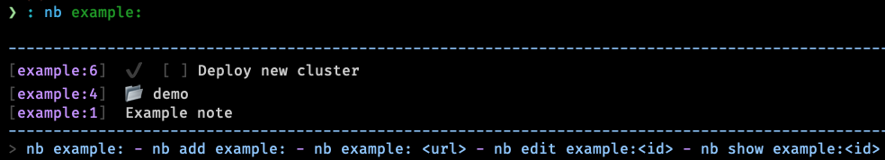

In my understanding, notebooks make sense if you keep multiple logically
unrelated corpora of notes.

# Folders

`nb` also supports folders which act exactly as you would expect a folder to.
Folders can be used to organize or hierarchically order your notes. In `nb`,
they help to reduce clutter of your notes because any note inside a folder is
not displayed by default.

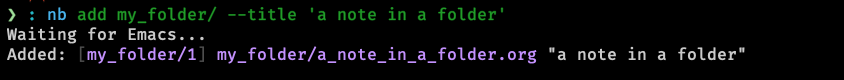

Folders (unlike notebooks) will be created on the fly as needed given the path
of the note you want to create. In this case, the folder `my_folder` was created
dynamically in order to create the note.

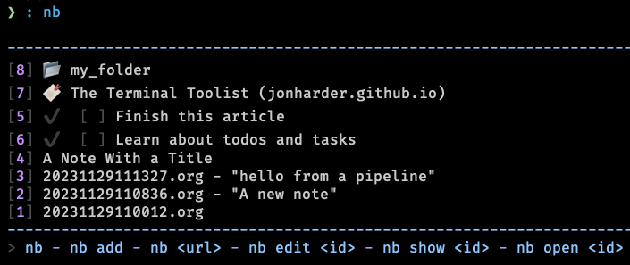

You can view the contents of a folder by issuing the folder name and a `/`.


Pretty much every command can be prefixed with a selector, meaning you can put
your bookmark in a different notebook, a todo inside a folder, a note inside a
different notebook\'s nested folder, etc.


# Search

`nb` has intuitive and powerful search functionality, allowing you to search for
strings, regexes, tags (covered briefly in this article, but you should check
[them](https://xwmx.github.io/nb/#-tagging) out in full), types of notes, and
combine all of the above with Boolean operators: `--and` and `--or`. The
sub-command to search is `search` or `q` for short.

Searches are performed in the current notebook by default, but like any other nb
command, can target any notebook and/or folder if desired.

Searches can be made across _all_ of your notes using the `-a` flag.

I won't go much deeper into `nb`\'s search functionality, so you can check it
out yourself if you're interested. It's very easy to figure out and follows
intuitive conventions if you've used any searching tool before.

To get a feel for how searches work, here are a few examples taken from the
docs:

```bash
# search current notebook for "example query"
nb search "example query"

# search the notebook "example" for "example query"
nb search example: "example query"

# search all unarchived notebooks for "example query" and list matching items
nb search "example query" --all --list

# search for "example" AND "demo"
nb search "example" "demo"

# search for "example" AND "demo"
nb search "example" --and "demo"

# search with regular expression
nb search "\d\d\d-\d\d\d\d"

# search for items tagged with "#tag1"
nb search --tags tag1

# search for items tagged with "#tag1" (short version)
nb q -t tag1

# search for items tagged with "#tag1" (even shorter version)
nb q "#tag1"

# search in the "example" notebook for "example"
nb example:q "example"
```

# Conclusion

`nb` is busting at the seams with functionality. This article has covered maybe
a quarter of all the things it can do. Their
[documentation](https://xwmx.github.io/nb/#overview) is fantastic and covers
everything I didn't have time to. Additionally the built in help is also
comprehensive (`nb help`, or just throw a `--help` onto any command you\'re
trying to work with). It also supports linking notes to each other (see
[docs](https://xwmx.github.io/nb/#-linking)), syncing notes automatically using
a git repository, color themes, a robust plugin system, images, videos
(`nb import`, [docs](https://xwmx.github.io/nb/#%EF%B8%8F-import--export)), and
more.

Despite the overwhelming breadth of features, I've found working with `nb` very
pleasant to explore incrementally. Commands are well documented, arguments are
flexible, meaning you don't have to memorize the exact order or name of every
command; even if you're close, `nb` will likely understand what you were trying
to do, and will do it for you.

I especially like that you can specify your preferred file format; `nb` doesn't
force you to use whichever format they decided is best; you get to choose.[^4]

I also greatly appreciate that all your notes are stored on your filesystem, in
a simple folder structure stored in `~/.nb`.

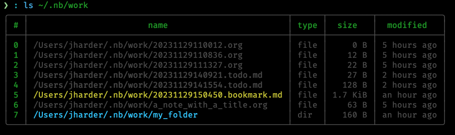 In a world of cloud only, proprietary solutions, I
find myself looking for simple solutions using existing and well known
technologies with a preference for offline first. I want to be able to zip my
notes and copy them to another computer, or better yet, utilize Dropbox or git
to track and transfer changes. `nb` manages syncing behind the scenes for you
using git if you provide a remote repository for it to sync with. This is the
simplest solution to sync I have seen. If you're interested in more of the
details of `nb`'s sync functionality, see their
[docs](https://xwmx.github.io/nb/#-git-sync) on the concept.

Even refreshing note taking tools like [obsidian](https://obsidian.md/) which
store your notes in plain markdown on your machine require a paid subscription
for access to their sync functionality, while other tools silently migrate
useful features from their free plans into their paid ones.

`nb` strikes a balance between the do-it-yourself freedom of note organization
and the power that comes from enforcing a known format (todos, bookmarks,
notebooks, etc.). The only "missing" feature I noticed was a lack of mobile
support, but that hardly feels fair to fault a terminal note taking tool for
missing. If that's a deal breaker, perhaps `nb` won't be the perfect tool for
you.

It was easy enough to get started with `nb` and because the files are any format
you like, stored on your computer, you risk nothing if you don\'t end up liking
it, so I'd recommend just giving it a shot.

# Footnotes

[^1]: This isn't quite true, as there is a fairly well supported note browser
    that can be started from the `nb` binary with `nb browse --gui`.

[^2]: <https://xwmx.github.io/nb/#optional>

[^3]: This opened a buffer in my emacs session with the given file.

[^4]: This holds true for notes, but bookmarks and todos are markdown files.
    Always.
