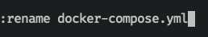
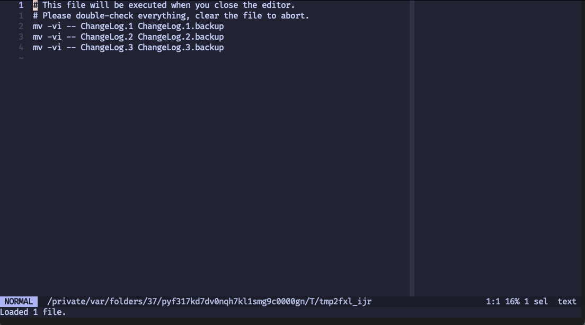

+++
date = '2023-10-06T16:00:00-06:00'
draft = false
title = 'Ranger'
show_reading_time = true
tags = ['file_manager', 'review']
+++

[Ranger](https://ranger.github.io/) is a "console file manager with VI key
bindings." Specifically it is a terminal file manager. You're most likely
familiar with GUI file managers in the form of mac\'s finder, or the directrory
viewer built into your editor of choice.

Terminal file managers live in a unique space as they tend to focus on keyboard
based workflows over click-and-drag mouse-based workflows. How can you get
anything done as a file manager using just your keyboard? If you're in the
terminal, why not just use good ol\' `cd`, `mv`, `cp`, `rm` and friends?

What you lose in intuitive (read: familiar) UI, you gain in expressive and
configurable power.

Convinced? Not yet? Let's see some examples

## Installing

If you want to follow along and run these examples in your own terminal, you can
install ranger easily using the package manager on your operating system. On
mac, it\'s as easy as:

```shell
brew install ranger
```

## Overview


This is the initial view using ranger. You\'ll notice three vertical columns
(and three highlighted files/directories). The center of the three is the
working column, and it\'s on the selected entry in this column that your actions
will operate (in this example, on the `kubernetes` directory).

The left column is the parent directory, and the right directory displays either
the contents of the current directory if a directory is highlighted, or a
preview of the file if a file is highlighted.


You might recognize this three-pane design pattern. If you've used the GUI file
manager for macOS, Finder, this design has been a staple since their
[NeXT](https://flaming.codes/posts/miller-columns-filesystem-ui) days.


## Navigation and file manipulation

### Movement

For a tool that touts "VI key bindings", no one should be surprised at the basic
file and directory navigation keys: `h`, `j`, `k`, and `l`. `j` moves the
selection in the center column one item down. `k` moves one item up. `l` will
either move into the directory of the selection, or open the file of the
selection by using your configured
[\$EDITOR](https://bash.cyberciti.biz/guide/$EDITOR_variable). `gg` moves the
cursor to the first item in the directory, `G` moves it to the bottom.

Moving around with h, j, k, and l allows you to fly around your file system, and
the three-column view gives you a quick view of not only what's in the current
directory, but also both what's in the parent directory and child directory.

If this was all ranger could do, it would already be a fairly handy, albeit
limited use tool (it also wouldn't really be a full 'file manager' in that case
either). Ranger handles much more however.

### Copying, Deleting, Moving

Ranger takes the "VI bindings" much further than simple movement. Want to copy a
file? Hit `yy` (the letter y, hit twice) to copy the file into a temporary
register, then in the destination of your choice, hit `pp` to paste the file.
Deleting is much the same; just hit `dd` to delete your file. To move a file,
you just delete `dd` but then paste it `pp` wherever you want.

Change your mind about deleting a file before pasting? Hit `u` to undo the
delete. Want to copy multiple files? Hit `Space` over all the files you want to
copy (they should be marked with a different color and be indented slightly to
show they\'re selected), then use `yy` and `pp` as before only this time, all
the selected files will be copied/pasted.


In this example, `app.go`, `db.go`, `Dockerfile`, and `main.go` are selected
(but **not** `tracing.go`). When you mark a file, the highlighted line is
automatically moved to the next item (so you can just hit `Space Space Space`
and select consecutive items), but it is not included in the multiple selection.

### Renaming

So far, the mechanism to move a file does not allow for renaming it (it is just
copied and pasted without changing anything). How do you rename a file then?
Like in vim, there's multiple ways to edit a file name (analogous to a
[word](https://learnbyexample.github.io/tips/vim-tip-22/) in vim). To completely
change the file name, you can hit `cw` (change word, in vim language). This
gives you a blank text input area to rename the file to whatever you want. If
you only wanted to change the [basename](https://linux.die.net/man/1/basename)
of the file, you can hit `a`, and the rename prompt field will be pre-populated
with the file and the cursor will be on the `.` file just before the extension.


If you want to change the extension (or just want to have the whole file name
pre-populated so you can change whatever you want), hit `A` and the cursor will
be at the very end of the file name in the prompt.



And lastly if you want to prefix something in front of the file name, you can
hit `I` to pre-populate with the file and the cursor at the front.


### Bulk renaming

But what if you have a bunch of files to rename, and you may or may not want to
rename them differently? What if you want to make the same change to each file
name?

After highlighting the files you\'re interested in, type `:bulkrename` (ranger
offers tab completion so you can just type `:b<TAB>` and the rest will be filled
in for you). A temporary file will be spun up with each of the file names you
selected. You can use the full power of your editor to rename the files however
you want.


When you exit the file, another temp file will be conjured up giving you a
preview of the shell commands it will run (using `mv`). You have one last chance
to change things (like changing the destination directory the files will be
renamed/moved to). After saving, ranger will execute the rename.



# Further reading

This only scratches the surface of ranger\'s functionality. Ranger supports
tabs, bookmarks, macros custom user-defined functionality using python and more.
Their [documentation](https://github.com/ranger/ranger/wiki/Official-user-guide)
is extensive and it can do more than I have the time to go over. The
`:flat` command is particularly interesting.

# Alternatives

Beyond ranger, there are a handful of other terminal file managers with varying
degrees of overlap in their design goals. These are just the ones that more or
less conform to the multi-window view that ranger does.

- [nnn](https://github.com/jarun/nnn)
- [joshuto](https://github.com/kamiyaa/joshuto)
- [lf](https://github.com/gokcehan/lf)
