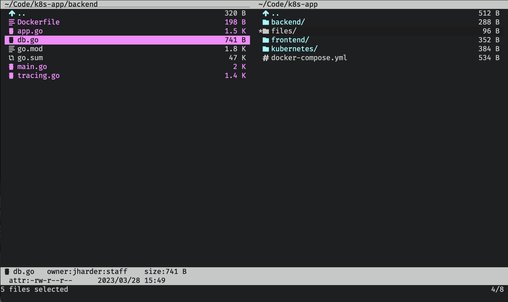

+++
date = '2023-10-20T16:00:00-06:00'
draft = false
title = 'Vifm'
tags = ['file_manager', 'review']
+++

## Introduction

Vifm is the vi file manager. It uses dual window design reminiscient of midnight
commander, but attempts to replicate vi keybindings as much as possible.


_NOTE: I have installed the catppuccin theme and the
[vim devicons](https://github.com/thimc/vifm_devicons) plugin._

The emulation is so complete that I can confidently say, if you know how to use
vi (or vim or neovim) you already know how to use vifm. Your intuition as to
moving around, copying and pasting files, using marks, etc will guide you to the
correct key or command.

For some of you, this might already be enough of a sell that you could close
this tab, install vifm, and have some fun exploring its features. For the rest
of you however, I'll dig into some of the unique features, quirks and pain
points.

## Basic features

As expected, all the basic navigation from vim works here. `h`, `j`, `k` and `l`
move up, down, back and forward through the directory tree. `gg` moves to the
first item in the current directory, `G` goes to the last. `H`, `M`, `L` move to
the top, middle, and bottom of the visible window's contents.

You can rename, cut, copy, and delete files just like you would expect for a vim
inspired file manager (just like in [ranger](/posts/ranger#renaming). And bulk
updates work the same way (using a temporary file which you edit in order to
specify the desired changes)

## Finding files

There are many commands you can execute by triggering `ex` mode (using `:`).
However one notable one that deserves some attention is `:grep`.

Consider the following situation: You're at the root of some project, and you
want to find all the files which contain the string `db`.


Execute `:grep database`, and a window will pop up with all the results
recursively.


Hmmm... that certainly gave us _all_ the results. But there's probably some
files included in the results that we don\'t care about, notably `go.mod` and
`go.sum`.

Let's select those two files (using `t`), then invert the selection (using
`:invert s`, for invert selection)



Now running grep will limit its search to only the selected files.


Now that's much easier to work with. This window can be navigated with the same
vim bindings for regular navigation, and pressing (`l` or `enter)` on any of the
lines will jump into that file to the relevant line.

## Marks

True to its vim inspiration, you can use
[marks](https://vim.fandom.com/wiki/Using_marks) to set temporary bookmarks you
can jump back to later. The marks you set are ephemeral and are lost when you
close vifm.

Marks can be made permanent by adding them to the
[_configuration_](#configuration) file. This is a great way to set easy access
to common directories you work on frequently.

Speaking of configuration, vifm supports a huge number of configurable settings.
It should be a surprise to no one that the syntax of its configuration file is
the same as vim's.

## Configuration

Stored in `~/.config/vifm/vifmrc`, vifm's configuration comes pre-populated upon
installation with extensive commentary and default values for each setting. You
can change this file however you like, there are many like it, but this one is
yours.

For example, to add by default a mark for your home directory, add the following
line to your `vifmrc`:

```vimrc
mark h ~/
```

Now, any time you want to jump home in vifm, simply hit `'h`.

To fully explore all the configuration settings would warrant a whole article of
its own so I'll end the discussion here for now.

## Conclusion

This is a shorter article is part because there is so much overlap with ranger,
which received a fuller write up.

Vifm and ranger share many keybindings and a similar philosophy, so why would
you choose one over the other? In my mind it depends on two things. 1. Do you
like miller columns[^1] or dual window displays? And 2. do you like to customize
your tools with a programming language (ranger uses python) or a simple
declarative format like vifm's?

Additionally, though ranger utilizes many vim keybindings, only vifm can
honestly claim "If you know vim, you know vifm". That's a pretty strong
statement that I'm making on their behalf. This is perhaps the biggest sell, and
it may just be the deciding factor for you.

There's no right or wrong here, but simply a matter of taste. Whichever you
choose, you can rest assured that taking time to find the tool works for you
will remove one source of friction in your workflow.

This also concludes the month of terminal file managers. Coming up next will be
a series of articles reviewing basic POSIX tools and how to squeeze every last
ounce of utility you can.

# Footnotes

[^1]: Vifm technically supports miller columns as well using `:set millerview`
    but I struggled to get it working nicely. I would say if you really want
    this design, ranger may be the better choice for you.
