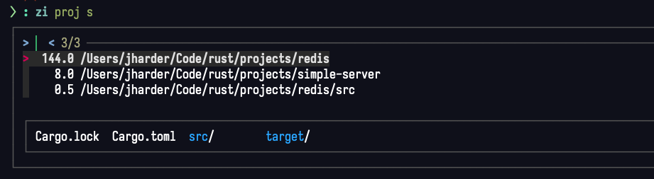

+++
date = '2024-01-19T16:00:00-06:00'
draft = false
title = 'zoxide'
show_reading_time = true
tags = ['review']
+++

# Overview

[Zoxide](https://github.com/ajeetdsouza/zoxide) is a small and focused
command line tool that supercharges the
[cd](https://man7.org/linux/man-pages/man1/cd.1p.html) command. Its goal
is to reduce repetitively typing out paths to directories you've
already visited.

You can use it as a drop in replacement for cd and use it exactly how
you would use cd. Once installed, every time you change to a directory
with `z` (the name of the binary zoxide installs into your path) it
remembers the path for later. Later, it uses this history to parse `z`
paths using arbitrary fragments of that path.

# Example

Say you have a project you often work on in a deeply nested folder
structure. Normally you might `cd` to it like so:

```bash
cd ~/path/to/a/very/nested/directory/with/my/project_a
```

If instead you ran:

```bash
z ~/path/to/a/very/nested/directory/with/my/project_a
```

Zoxide would remember this path. The next time you wanted to get to this
path, you could just type any portion of it and Zoxide would find the
best match of the directories you've changed to.

For example:

```bash
z proj
```

Would send you back to the same directory.

If you had multiple directories that might match on just that string,
you can add multiple parameters to refine your search:

```bash
z nest proj
```

# Interactive selection

Using the `z` command aims to be a deterministic solution to changing
directories. This means if you give it *any* input, it will just pick
the option it thinks most closely matches. Most of the time, zoxide is
very smart and its pick is probably what you want. However, if you can
only remember a very generic portion of the path, picking whichever path
zoxide thought was best may not be what you want.

In this case, you can use a close sibling, `zi` which is just like `z`,
but uses [fzf](/posts/fzf) to allow the user to select between
the most likely candidates of your search.



# Conclusion

That's all folks. Zoxide is great, intuative, and simple. Install it.
Use it. Enjoy it.
